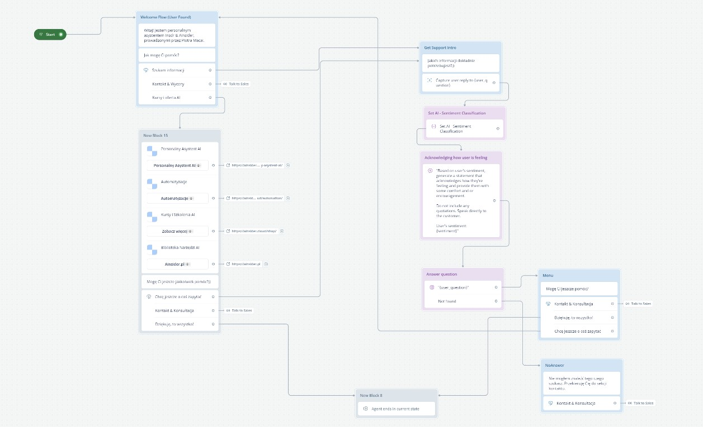
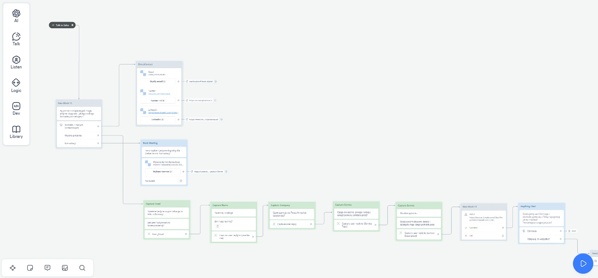
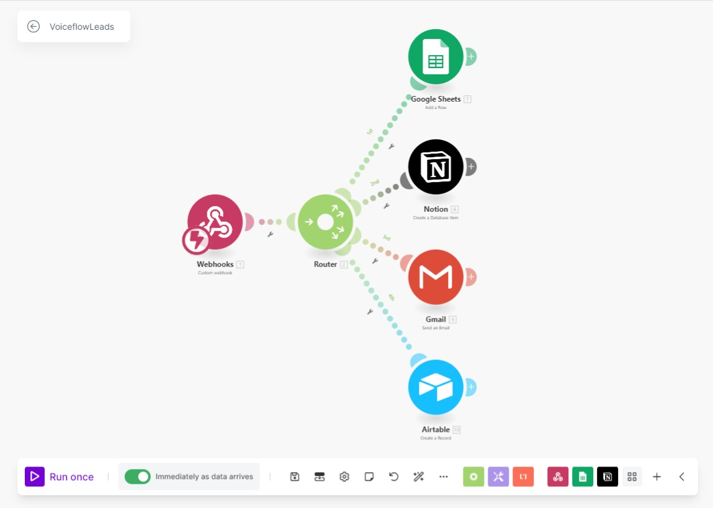

AI Business Support Agent

This repository contains the workflow and integration setup for an AI-based customer support agent, built using Voiceflow and Make (formerly Integromat). The agent is designed to provide efficient business support, including lead generation, product and service recommendations, and seamless CRM integration for managing customer interactions. This project aims to enhance business operations by automating customer support, recommending tailored services/products, and transferring qualified leads to the chosen CRM.

Overview
The AI Business Support Agent is structured to handle customer inquiries, provide personalized responses, and categorize user sentiments for improved interaction quality. Additionally, it generates leads and seamlessly integrates with Make to transfer these leads to the selected CRM, ensuring efficient follow-up and potential sales conversions.

Key Features
Automated Customer Support:
Answers frequently asked questions about products, services, and company information.
Routes complex inquiries to a human representative when necessary.

Product and Service Recommendations:
Uses pre-defined categories to recommend suitable products and services based on customer needs.
Directs users to relevant offerings, enhancing customer engagement and satisfaction.

Sentiment Analysis:
Classifies user sentiment to personalize responses and provide empathetic support.
Responds according to user emotions, improving customer experience.

Lead Generation:
Captures customer details and categorizes them as leads based on interaction quality.
Sends lead information to a specified CRM through Make for further processing and follow-up.
CRM Integration:

Utilizes Make to automate lead transfer to the selected CRM or Database with notification with email, enabling quick and organized lead management.
Supports various CRM platforms, allowing flexibility in CRM choice.

Project Structure
Voiceflow Project: Contains the main conversation flow, including decision blocks for support topics, recommendation paths, and sentiment classification.
Make Automation: Automates the CRM integration, transferring lead data from Voiceflow to the designated CRM in real time.

Prerequisites
Voiceflow Account: To customize or extend the conversation flow, an active Voiceflow account is needed.
Make Account: For CRM integration, a Make account is required to configure automations and transfer lead data.
CRM Platform: Any compatible CRM of your choice for lead storage and management.

Configure Voiceflow:

Import the provided workflow into your Voiceflow account.
Customize the agent responses and recommendation logic to align with your business needs.

Connect Make to your CRM and Voiceflow.
Configure an automation to transfer lead information from Voiceflow to the CRM in real-time.
Run the Agent:

Deploy the Voiceflow project and start testing the agent’s responses and CRM integration.
